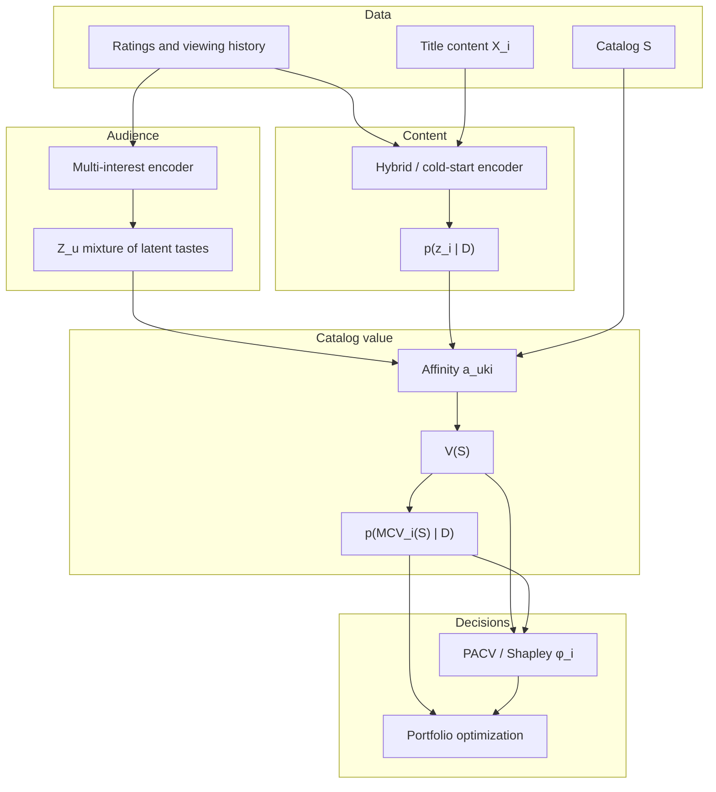

# Portfolio-Aware Content Valuation

The value of a title is contextual. It depends on the audiences it serves, the
needs already satisfied by the existing catalog, the titles with which it
substitutes or complements, and our uncertainty about its audience.

This repository estimates the distribution over **marginal audience coverage**
of adding or removing a title from a catalog, then uses those estimates to
construct counterfactual content portfolios.

The primary modeling target is

```math
p(\mathrm{MCV}_i(S) \mid D),\qquad \mathrm{MCV}_i(S) = V(S \cup \{i\}) - V(S)
```

not $P(\text{viewer watches } i)$ or $E[\text{rating}]$ alone.

## What the model estimates

Audience **preference coverage**: how well a set of titles covers heterogeneous
latent viewing needs.

It does **not** estimate subscription retention, acquisition, ad revenue,
licensing cost, profit, causal engagement, or platform recommendation exposure.
MovieLens missingness is non-random; an unrated title is not a dislike.
Streaming availability is not homepage exposure.

Language such as "Netflix should license X" is out of scope. Prefer: *under the
model's audience-coverage objective, X has high estimated marginal value
relative to the observed Netflix-US catalog.*

## Four learned objects

1. **Audience** → mixture of latent demand states $`Z_u = \{(\pi_{uk}, z_{uk})\}`$
2. **Content** → probabilistic title representation $`z_i \sim p(z_i \mid D)`$
3. **Audience states + catalog** → catalog utility $`V(S)`$
4. **Catalog-utility posterior** → portfolio decisions



Phase A implements (1)–(3) with a **taste-token transformer** audience encoder
(K learned queries over each user's title set), learned title embeddings, and
an analytical log-sum-exp coverage function. Later phases add a genome-tag
content encoder and title posteriors, map real US catalogs onto that space,
and estimate PACV / greedy portfolios. An SVD + k-means backbone remains as
an ablation (`train.backbone: svd`).

See `docs/model.md` for the compact formalization,
[`docs/story.md`](docs/story.md) for a short take-home with figures, and
[`docs/catalog-value.pdf`](docs/catalog-value.pdf) for the full report
(motivation, value, assumptions, step-by-step model).

## Setup

```bash
./setup/bootstrap.sh
```

Requires [uv](https://docs.astral.sh/uv/). Python 3.12.

Bootstrap copies `.env.example` → `.env` if needed, installs [direnv](https://direnv.net/), and hooks **bash** (`~/.bashrc`, login via `~/.bash_profile`) and **zsh** (`~/.zshrc`) so `.env` is loaded when you `cd` into the repo. Put your TMDB key in `.env` (never commit it).

## Run
uv run python -m catalog_value fit
uv run python -m catalog_value phase-a   # popularity vs MCV + title atlas
uv run python -m catalog_value phase-b   # content encoder, posteriors, cold start
uv run python -m catalog_value phase-c   # US catalogs on the title map
uv run python -m catalog_value phase-d   # PACV, greedy portfolios, ablations
```

`phase-b` needs MovieLens genome tags (written by `ingest`). `phase-c` needs a
TMDB watch-provider snapshot (`snapshot-catalogs`).

Artifacts land in `outputs/`. Published figures live in `docs/figures/`.
The write-up is [`docs/story.md`](docs/story.md).
Tests (no MovieLens download required):

```bash
uv run pytest
```

## Repository layout

```text
configs/                experiment configs
data/{raw,intermediate,processed}/
docs/report.md          full write-up (source of the PDF)
docs/catalog-value.pdf  printable report
docs/story.md           short take-home with figures
src/catalog_value/
  data/                 MovieLens ingest
  models/audience/      multi-interest user states
  models/content/       collaborative + genome content encoder
  models/catalog_value/ coverage, MCV, PACV
  optimization/         greedy MCV portfolios
  visualization/
experiments/            probes and catalog scoring scripts
tests/
```

## Phases

| Phase | Scientific question | Status |
| --- | --- | --- |
| A | Are popularity and MCV different? | done |
| B | Do probabilistic / content representations change MCV under cold start? | done |
| C | Do real U.S. streaming catalogs occupy different audience regions? | done |
| D | Ablations, PACV, fairness, risk frontiers, write-up | done |
