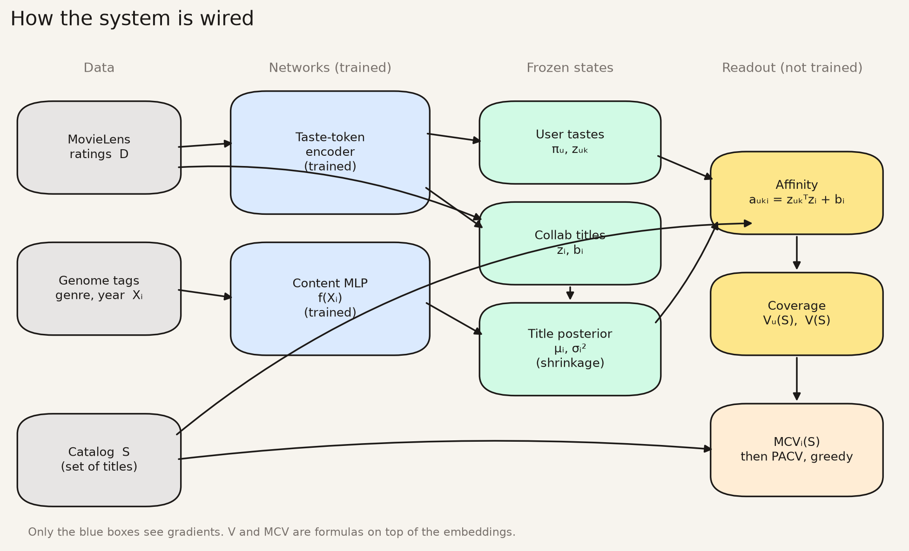
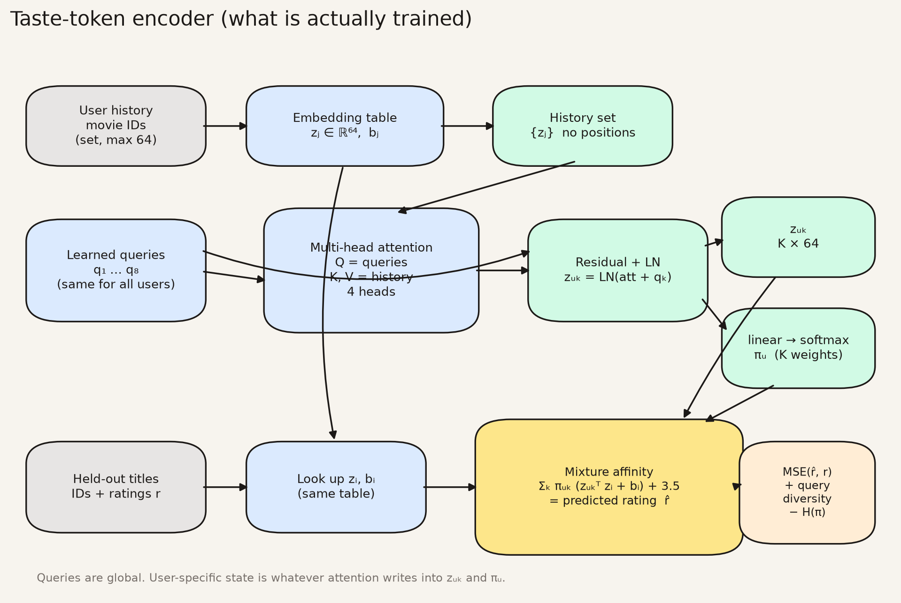
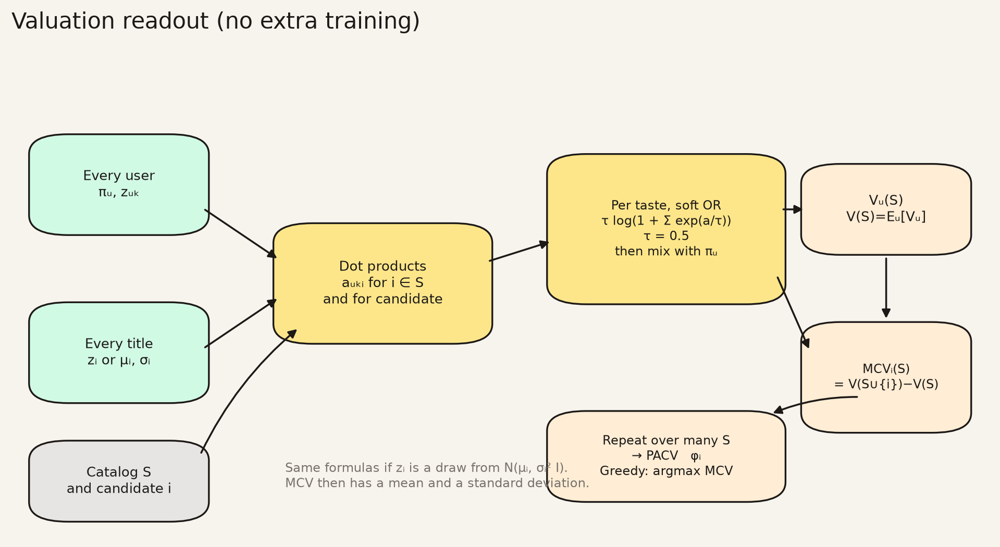

# How to read this

This is the full write-up of the project: why it exists, what *value* means here, what we assumed, how the model works, what we ran, and what that evidence supports.

Each technical step is written three times on purpose.

- **Plain.** No jargon. Enough to follow the argument if you have never trained a model and do not work in film or television.
- **For a data scientist.** Objects, losses, identification. Baseball analogs are here because that is a useful roster-construction language, not because movies are baseball.
- **The math.** The actual formulas the code implements.

If you only want the conclusion, read [What is value?](#what-is-value) and [Take-home](#take-home). The rest is the warrant.

A **title** is one movie or show. A **catalog** is the set of titles a service offers. **Popularity** here is how many people in MovieLens rated it, not box office and not hours streamed.

# Motivation

## The industry default

Film and television titles are usually scored as if they were independent assets: box office, ratings, critic scores, completion rate, hours watched. Those numbers answer "how much did this title do, on its own?"

A streaming catalog is not a pile of independent assets. It is a *set*. People do not need five near-identical action movies. They do need the catalog to cover different reasons for watching: a kid's night, a date, a horror binge, a serious drama. The value of adding *Die Hard 2* depends on whether you already have *Die Hard*. The value of adding a 1957 Kubrick war film depends on whether anyone in the audience is unserved by the hits you already bought.

That is a portfolio problem. Sports already has the language: you do not rank free agents only by career home runs. You ask what they add to *this* roster. A third slugging outfielder on a team that already has two is not worth his raw power numbers. A specialist can be, even with a shorter track record, if the roster is empty on that side.

## The scientific target

The quantity we want is not "probability someone watches title $i$" and not "expected rating of $i$." Those are useful for ranking a homepage. They are the wrong target for asking whether $i$ belongs in a catalog $S$ that already exists.

We want the **marginal audience-preference coverage** of $i$ given $S$:

$$
\mathrm{MCV}_i(S) = V(S \cup \{i\}) - V(S)
$$

and, eventually, a distribution $p(\mathrm{MCV}_i(S) \mid D)$ because $i$ may be new and $S$ is not the only catalog we might have had.

$V(S)$ is defined in the next section. The point of the project is to make $V$ and MCV *computable* from public ratings, *inspectable* (you can see why a title scores high or low), and *tested* against obvious alternatives (popularity, SVD, content-only, one catalog vs many).

## Why not just use watch probability?

Because $P(\text{watch } i)$ can be high for a title that is a substitute for something you already have, and low for a title that covers an uncovered taste. Homepage rank and catalog value can disagree. This repo is about the second.

## What this is not for

It is not a licensing recommendation, a pricing model, or a retention model. Language such as "Netflix should buy $X$" is out of scope. The allowed sentence is: *under this coverage objective, relative to this catalog, $X$ looks like a gap or a duplicate.*

# What is value?

This is the load-bearing definition. Everything else is machinery.

## Plain

**Value, in this project, is how well a *set* of titles covers the different things people in the audience seem to want, as revealed by what they rated highly.**

It is not:

- how famous the title is
- how good the title is as art
- how many hours it would be streamed
- how many people would subscribe or cancel
- how much it costs to license
- whether the service would put it on the homepage

A catalog that covers kids, horror, and serious drama has more value on this definition than a catalog of five interchangeable action movies, even if those five are more famous.

The value of *one* title is not a property of the title alone. It is **how much coverage you gain by adding it to a specific catalog**. If the catalog already covers that taste, the title is nearly worthless as an add-on. If it covers an open taste, it is valuable even if fewer people have heard of it.

In roster language: value is "how complete is this 26-man roster for the games we actually play," and a player's value is "how many wins they add to *this* roster," not their career counting stats.

## For a data scientist

Let $S$ be a set of titles. Let the audience be a distribution over users $u$, each with a mixture of latent tastes. $V_u(S)$ is a monotone, submodular coverage function of the affinities between those tastes and the titles in $S$. $V(S) = \mathbb{E}_u[V_u(S)]$.

Submodular means diminishing returns: adding $i$ to a small set helps at least as much as adding $i$ to a larger set that already contains similar titles. That is the mathematical form of "we already have this."

Identification: we never observe $V$. We observe ratings $r_{ui}$ for some pairs $(u,i)$. We assume that predicted rating (affinity) is a sufficient statistic for whether title $i$ covers a taste of $u$. That is a strong assumption (A4 below). We then *define* $V$ as a function of those affinities; we do not learn $V$ from catalog-level outcomes (nobody subscribed or churned in this dataset).

So "value" is an **operationalized coverage functional**, not an estimated willingness-to-pay.

## The math

User $u$ has mixing weights $\pi_{uk}$ and taste vectors $z_{uk}$, $k=1,\ldots,K$. Title $i$ has vector $z_i$ and bias $b_i$. Affinity:

$$
a_{uki} = z_{uk}^\top z_i + b_i
$$

Per-user catalog value, temperature $\tau > 0$:

$$
V_u(S) = \sum_{k=1}^{K} \pi_{uk}\, \tau \log\Bigl(1 + \sum_{i \in S} e^{a_{uki}/\tau}\Bigr)
$$

$$
V(S) = \mathbb{E}_u[V_u(S)]
$$

As $\tau \to 0$, coverage inside a taste approaches $\max_i a_{uki}$ (one good title saturates the taste). As $\tau \to \infty$, it approaches additive value. We use $\tau = 0.5$: substitutes flatten; a title pointing somewhere else still moves $V$.

Marginal content value:

$$
\mathrm{MCV}_i(S) = V(S \cup \{i\}) - V(S)
$$

Portfolio-adjusted value, averaging over catalogs:

$$
\phi_i = \mathbb{E}_S[\mathrm{MCV}_i(S)]
$$

The modeling target is $p(\mathrm{MCV}_i(S) \mid D)$. Phase A reports a point estimate. Phase B puts a Gaussian around $z_i$ and reports mean and standard deviation from draws.

# Assumptions

These are not caveats at the end. They are the conditions under which the numbers mean what we say they mean.

**A1. Ratings are a preference signal, not behavior.** MovieLens is 1--5 stars from people who chose to rate. It is not watches, not completion, not a streaming log. High rating $\approx$ "this covered something I wanted." That can be false (prestige bias, recency, rating a movie you hated so you can complain).

**A2. Missing is not dislike.** An unrated title is not a negative. People cannot rate 13,000 movies. Missingness is non-random (popular titles are rated more). Collaborative embeddings therefore mix "who likes this" with "who was exposed to this."

**A3. The audience is MovieLens raters, not subscribers.** US streaming subscribers in 2026 are a different population. We never claim otherwise.

**A4. Affinity is sufficient for coverage.** Once we have $a_{uki}$, we treat it as how well $i$ serves taste $k$ of $u$. We do not model that someone might love a title and still not need it in the catalog (they already own the disc), or hate rating and still watch.

**A5. Histories are sets, not sequences.** The encoder has no positions and no timestamps in the attention. Order of watching does not enter $z_{uk}$. "Watch A then B" complementarity is assumed away.

**A6. Substitution, not complementarity.** $V$ is a log-sum-exp. Universes, sequels, and "this pairs with that" are not in $V$. If two titles are complements, we will *undervalue* adding the second.

**A7. Users are exchangeable for $V(S)$. ** We report $\mathbb{E}_u[V_u(S)]$ on a random subsample of 4,000 users. We do not weight by expected spend, household size, or churn risk.

**A8. $K=8$ tastes exist in the architecture, not necessarily in the fit.** The encoder *can* specialize. In this checkpoint mixing weights $\pi_u$ stayed almost uniform. Claims about "eight taste tribes" are not supported.

**A9. Two epochs of rating MSE.** The encoder was trained to predict held-out ratings, not to maximize $V(S)$. Diversity on queries and an entropy bonus on $\pi$ are regularizers, not the scientific target. Underfitting of $\pi$ is expected.

**A10. Catalogs are TMDB US flatrate $\cap$ MovieLens core.** "Netflix" in the tables is not the 2026 Netflix app. It is the subset of MovieLens films TMDB listed as US subscription-available for that brand. MovieLens is mostly pre-2020 theatrical titles. Homepage rank is unobserved.

**A11. Cold start is simulated with tags still present.** Held-out titles still have genome tags, genre, and year. That is "prospect with a scouting report, no playing log," not "brand-new show with a logline."

**A12. Scale is not money.** $V$ and MCV are in model units. Rankings and neighborhoods transfer better than the number on the axis. SVD and content encoders change the scale.

**A13. PCA is a camera.** Two-dimensional plots are projections of 64-dimensional vectors. Neighbors, $V$, and MCV are computed in 64-d. Empty space on a PCA plot is not a hole in taste space.

# What we built

Public data, a neural audience encoder, an analytical coverage function, a content posterior for titles with few ratings, and four experiments.

| Phase | Question | What we ran |
| --- | --- | --- |
| A | Are popularity and MCV different? | Taste-token encoder on MovieLens 25M core (162,242 users $\times$ 13,176 titles). MCV vs rating count for 1,500 candidates given a 500-title popular catalog. Title atlas, neighbors, diminishing returns. |
| B | Do content / probabilistic reps change MCV under cold start? | MLP from genome tags + genre + year $\to$ 64-d. Shrinkage posterior. 20% title holdout. Neighbor swap, MCV rank transfer, uncertainty. |
| C | Do US catalogs occupy different regions? | TMDB US flatrate membership for Netflix, Disney+, Prime, Max, Hulu, intersected with MovieLens. $V(S)$, occupancy on the atlas, title Jaccard vs map occupancy. |
| D | Is the ranking a fluke of one catalog or one backbone? | PACV over 80 random catalogs. Greedy MCV vs popularity stacks. SVD vs neural vs content ablation. Genre mix. |

Data: MovieLens 25M, filtered to users with $\ge 20$ ratings and movies with $\ge 50$. Genome tags cover 13,174 / 13,176 core titles. TMDB API for US watch providers.

Not trained: a model of churn, price, or complementarity. Not used: posters, trailers, plot text, or internal streaming logs.

# Architecture

Three pictures. The first is the whole system. The second is the neural net that is actually trained. The third is the coverage formula that runs after training stops.

**Plain.** There are two trained networks (blue). Everything yellow is arithmetic on top of their outputs. Gradients never enter $V$ or MCV.

**For a data scientist.** Taste-token encoder: shared item table + 8 learned queries + MHA over a user's title *set* $\to$ $(\pi_u, z_{uk})$ and $z_i$. Content MLP: $X_i \to f(X_i)$, then Gaussian shrinkage with collaborative $z_i$. Valuation: $a_{uki}=z_{uk}^\top z_i+b_i$, then log-sum-exp coverage, then finite differences for MCV.

{width=98%}

{width=98%}

{width=98%}

Shapes in the code (batch $B$, history length $L\le 64$, $K=8$, $d=64$, catalog size $n$):

| Tensor | Shape | Role |
| --- | --- | --- |
| `history` | $[B, L]$ | movie rows in the user's set |
| `item_emb` | $[N+1, 64]$ | shared title table (last row is pad) |
| `taste_queries` | $[8, 64]$ | global $q_k$, not per user |
| `z` (user) | $[B, 8, 64]$ | $z_{uk}$ after attention + residual + LN |
| `pi` | $[B, 8]$ | simplex mix, rows sum to 1 |
| `z` (title) | $[N, 64]$ | $z_i$ used at valuation time |
| `affinity` | $[U, 8, n]$ | $a_{uki}$ for a catalog of $n$ titles |
| `V_u` | $[U]$ | coverage of $S$ for each eval user |

# The model, step by step

The pipeline, in order:

$$
\text{ratings } D \;\longrightarrow\; z_i,\; b_i \;\longrightarrow\; q_k,\; \pi_u,\; z_{uk} \;\longrightarrow\; a_{uki} \;\longrightarrow\; V_u(S) \;\longrightarrow\; \mathrm{MCV}_i(S)
$$

Training only supervises the first arrow (predict held-out ratings). $V$ and MCV are readouts of those embeddings, not a second trained network.

## Step 0 --- Data

**Plain.** We downloaded a public dataset of people rating movies 1 to 5. We kept people who rated at least 20 movies and movies with at least 50 ratings, so the matrix is not mostly empty. That left about 162 thousand people and 13 thousand movies.

**For a data scientist.** Core subset after joint filtering: 162,242 users, 13,176 movies. `movie_row` / `user_row` are dense indices. Each training example is a user's history as a set of movie indices plus 4 held-out (movie, rating) pairs. History is truncated to 64 titles. No side information enters Phase A.

**The math.** Observe $D = \{(u,i,r_{ui})\}$ on a subset of pairs. Let $\mathcal{U}$, $\mathcal{I}$ be the filtered user and item sets.

## Step 1 --- Title embeddings $z_i$

**Plain.** Every movie gets a list of 64 numbers. Movies that the *same people* like are given similar lists. The model does not read the script. If *Toy Story* (the first Pixar film, essentially everyone has seen it) ends up near *Saving Private Ryan* (Spielberg's WWII film, also seen by essentially everyone), that is not a genre error. It is a statement about overlap in who loved both.

**For a data scientist.** $z_i \in \mathbb{R}^{64}$ is a row of `nn.Embedding(n_movies+1, 64)` with a padding row. $b_i$ is a scalar item bias. Initialization is $\mathcal{N}(0, 0.02^2)$. These are ordinary collaborative-filtering embeddings; the transformer around them is how users are read, not a text model. PCA plots later are a 2-d camera on $z_i$, analogous to a spray chart of a projection vector --- not the projection itself.

**The math.** Parameters $\{z_i, b_i\}_{i \in \mathcal{I}}$, $z_i \in \mathbb{R}^{d}$, $d=64$.

## Step 2 --- Eight taste queries read a user's set

**Plain.** A person is not one point. The model keeps eight "questions" it can ask of your rating history, like eight different ways of summarizing a roster. Each question looks at the movies you rated and produces its own summary, plus a weight for how much that summary counts. In this run, those weights stayed almost equal for everyone --- the eight questions did not become "horror vs kids vs comedy."

**For a data scientist.** $K=8$ learned query vectors $q_k \in \mathbb{R}^{d}$ attend over the user's item embeddings with multi-head attention (4 heads), no positional encodings. Residual + LayerNorm gives $z_{uk}$. A linear head plus softmax gives $\pi_u \in \Delta^{K-1}$. This is the "taste token" encoder: queries compete for mass over a set.

**The math.** Let $H_u = \{z_j : j \in \text{history}(u)\}$.

$$
\tilde z_{uk} = \mathrm{MHA}(q_k, H_u, H_u),\qquad
z_{uk} = \mathrm{LayerNorm}(\tilde z_{uk} + q_k)
$$

$$
\pi_{uk} = \mathrm{softmax}_k(w^\top z_{uk})
$$

## Step 3 --- Training: predict held-out ratings

**Plain.** We hide a few of each person's ratings and ask the model to guess the scores. We also nudge the eight questions not to copy each other, and nudge the weights not to collapse onto a single question. We did this for two passes through the data. That is not very long; the "not collapsing" nudge in particular seems to have frozen the weights near uniform.

**For a data scientist.** Loss on a batch:

$$
\mathcal{L} = \mathrm{MSE}(\hat r, r) + 0.05 \lVert Q^\top Q - I \rVert_{\mathrm{off}}^2 - 0.01\, H(\pi_u)
$$

where $\hat r$ is mixture affinity plus a global bias initialized at 3.5 (the rating scale midpoint). AdamW, lr $10^{-3}$, batch 256, gradient clip 1.0, 2 epochs, Apple MPS. After training we freeze embeddings and encode every user once.

Observed: query off-diagonal RMS cosine $0.012$ (diversity term worked). Mean $\pi$ entropy $2.077$ vs $\log 8 = 2.079$ (entropy bonus + short training: mixture did not specialize). Item bias barely tracks $\log n_{\text{ratings}}$ (correlation $0.03$).

**The math.** Predicted rating for held-out $i$:

$$
\hat r_{ui} = \sum_k \pi_{uk}(z_{uk}^\top z_i + b_i) + b_0
$$

## Step 4 --- Affinity

**Plain.** For each person, each of their eight summaries, and each movie, we ask "how well does this movie match that summary?" by lining up the two lists of 64 numbers and adding the movie's bias. High number: this movie serves that slice of that person.

**For a data scientist.** Dot product in the same space the encoder was trained in. No extra network. Scale of $z$ is small (mean $\lVert z_i\rVert \approx 0.31$), so affinities are modest; $\tau=0.5$ is in a reasonable range relative to that scale.

**The math.** $a_{uki} = z_{uk}^\top z_i + b_i$.

## Step 5 --- Catalog value $V(S)$

**Plain.** For each slice of a person, look at all the movies in the catalog and give credit as if you only needed *one good match*, with partial credit for extras that are not copies. Then average across that person's slices, then across people. A second *Die Hard* (the same kind of action movie) adds little. A movie that serves a different reason for watching still adds.

**For a data scientist.** Soft coverage $\tau\log(1+\sum e^{a/\tau})$ is monotone and submodular in $S$. We evaluate on 4,000 randomly sampled users. Empty catalog has $V=0$ because of the leading $1$ inside the log (the $\log(1+\cdot)$ form). $V$ of the 500 most-rated titles is about $3.49$ on this scale --- a number for comparing sets, not a currency.

**The math.** See [What is value?](#what-is-value). Implementation uses a stable $\mathrm{logsumexp}([0, a_{uki}/\tau]_{i\in S})$.

## Step 6 --- Marginal content value

**Plain.** Hold the catalog fixed. Ask how much $V$ goes up if we add one more title. That increment is the title's value *given this catalog*. Famous movies that sit in a neighborhood you already cover get tiny increments. Less famous movies that sit where you have a hole get larger ones.

**For a data scientist.** Catalog $S$ = 500 most-rated titles. Candidates = next 1,500 by rating count (so we are not scoring ultra-rare items). Spearman(rating count, MCV) $= 0.07$. Implementation caches $\log(1+\sum_{S} e^{a/\tau})$ and uses $\mathrm{logaddexp}$ for each candidate. Titles already in $S$ get MCV $0$.

**The math.** $\mathrm{MCV}_i(S) = \mathbb{E}_u[V_u(S\cup\{i\})-V_u(S)]$.

## Step 7 --- Content encoder and title posterior

**Plain.** If nobody has rated a movie, Step 1 has nothing to go on --- like a prospect with no minor-league log. We train a second, simpler model on *what the movie is*: genre, year, and 1,128 human tags ("horror", "witty", "romance"...) that MovieLens already scored. For movies we hide the ratings of, we use only that. We also say we are less sure when ratings are missing.

**For a data scientist.** Feature $X_i =$ genome relevance vector (1128) $\oplus$ genre multi-hot (19) $\oplus$ scaled year. MLP (256 hidden, GELU, LayerNorm, dropout 0.1) predicts $(z_i, b_i)$. Train MSE against collaborative $z$ on titles with $\ge 200$ ratings, 80 epochs, 20% title holdout. Residual variance $\approx 0.0016$. Cosine(content, collab) $\approx 0.24$ (vectors are short; angle is a noisy metric). Spearman of MCV ranks on held-out candidates: $0.79$.

**The math.** Precision-weighted shrinkage, $n_0=400$:

$$
w_i = \frac{n_i}{n_i+n_0},\qquad
\mu_i = w_i z_i^{\mathrm{collab}} + (1-w_i) f(X_i)
$$

$$
\sigma_i^2 = \widehat{\mathrm{Var}}(z-f)\,(1-w_i),\qquad
z_i \sim \mathcal{N}(\mu_i, \sigma_i^2 I)
$$

Holdout titles get $n_i=0$ so $\mu_i = f(X_i)$. MCV mean/std from 16 posterior draws.

## Step 8 --- Averaging over catalogs, and building one

**Plain.** Maybe a title only looks valuable because we measured it against one specific library (the 500 hits). So we also average the increment over many random libraries. And we try building a library by always adding the currently most useful title, versus always adding the most famous remaining title.

**For a data scientist.** PACV: 80 catalogs of size 60 drawn from the top 400, 30 probe titles (high and low MCV from Phase A). Greedy MCV: 40 steps from a pool of 280 candidates vs the 40 most-rated titles. Ablation: rebuild SVD audience from a stored truncated-SVD fit (same $d=64$, $K=8$ k-means tastes) and compare MCV rankings to neural and to content $z$.

**The math.** $\phi_i = \frac{1}{M}\sum_{m=1}^{M} \mathrm{MCV}_i(S_m)$, $S_m$ random. Greedy: $i_t = \arg\max_{i\notin S_{t-1}} \mathrm{MCV}_i(S_{t-1})$.

# Evidence

Figures are computed from the trained checkpoint, not illustrations.

## Collaborative geometry is "who likes this"

{width=90%}

PC1 (36% of variance) runs roughly "widely respected" to "widely shrugged at." *The Godfather*, *Shawshank*, *Paths of Glory* (1957 Kubrick WWI film) sit left. *Super Mario Bros.* (1993 live-action bomb) is isolated right. Isolation is not a hidden gem; it is a bust cluster. Same-genre cosine 0.13 vs cross-genre 0.06: genre is visible and not the map.

{width=95%}

- *Super Mario Bros.* $\to$ *Striptease*, *Anaconda*, *Police Academy 6*: other widely released films people also dunked on.
- *Paths of Glory* $\to$ *Paris, Texas*, *The Third Man*, *The Lives of Others*: serious drama the hits catalog under-covers.
- *Halloween* (1978 slasher) $\to$ *Speed*, *American Pie*, *Jumanji*: 1990s multiplex co-rating, not other slashers.
- *Toy Story* $\to$ *Up*, then *Saving Private Ryan* and *The Matrix*: the "almost everybody loved this" neighborhood.

When two titles are close, covering one already covers a lot of the other.

## Popularity is not MCV

{width=85%}

Spearman **0.07**. Red: famous and redundant (*Batman & Robin*, *Space Jam*, *Pearl Harbor*). Teal: fewer ratings, high add-on value.

{width=90%}

High MCV is the left (cinephile/prestige), not the isolated right. *Super Mario Bros.* MCV $\approx 4\times 10^{-5}$. *Paths of Glory* $\approx 0.0029$.

{width=75%}

Action stack $V \approx 1.12$ at size 5; mixed stack **1.51**.

## Content changes neighbors; MCV rank mostly holds

{width=95%}

| Probe | Who rated this | What this is |
| --- | --- | --- |
| *Halloween* | 1990s multiplex hits | Classic slashers (*Texas Chainsaw Massacre*, *Evil Dead*) |
| *The Notebook* | 2000s action franchises | Romances (*Little Women*, *When Harry Met Sally*) |
| *Paths of Glory* | Serious-drama co-raters | War / moral-crisis films (*Das Boot*, *Full Metal Jacket*) |
| *Super Mario Bros.* | Famous bombs | Kids / video-game bombs |

{width=70%}

Spearman **0.79**. Content compresses the high end (*Double Indemnity*, *12 Years a Slave*) and can overvalue tag-oddities (*Eraserhead*).

{width=75%}

## Catalogs: disjoint lists, overlapping map

US flatrate $\cap$ MovieLens core --- not full 2026 libraries.

| Service | Titles in overlap | $V(S)$ | $V$ per title |
| --- | ---: | ---: | ---: |
| Prime Video | 1,807 | 4.01 | 0.0022 |
| Max | 617 | 3.59 | 0.0058 |
| Netflix | 486 | 3.32 | 0.0068 |
| Disney+ | 508 | 3.20 | 0.0063 |
| Hulu | 174 | 2.83 | 0.016 |

Prime is $\sim$10$\times$ Hulu in titles and $\sim$1.4$\times$ in coverage. Not "Prime is best." Hybrid posterior means shave $V$ by $\sim$5% and do not change order.

{width=98%}

{width=90%}

Taste-fingerprint cosine was identically 1. That is A8 (uniform $\pi$), not a fact about streaming.

## Rankings survive other catalogs and other backbones

{width=75%}

{width=75%}

{width=75%}

{width=90%}

# Take-home

**One sentence.** How famous a title is, and how much it adds to a library you already have, are different quantities --- and you can *see* why on a map of who-likes-what. Widely seen bombs live in one neighborhood. Less-seen serious films live in another that a stack of hits leaves open.

## What we learned

1. Popularity and add-on coverage barely move together (Spearman 0.07). These are different objects.
2. The split is a place, not a residual. High MCV: cinephile/prestige region. High-pop / low-MCV: flop cluster. Outliers are not automatically gems; you need uncovered *positive* affinity.
3. Collaborative "nearby" means the same people liked both, not the same genre. That is the right geometry for substitution.
4. A tag/genre/year encoder recovers genre without wrecking MCV rank (Spearman 0.79 on held-out titles). Operational cold start, given A11.
5. Libraries can share almost no titles (Jaccard $\le 0.07$) and still occupy similar regions of the map. Bigger is not linearly more coverage.
6. The ranking is not an artifact of one catalog or one backbone (PACV; Spearman 0.84--0.89). Greedy MCV barely lifts $V$ over a hits stack and *does* change composition (less Action, more Drama/Comedy/Crime).

## What we did not learn

Not who should buy what. Not eight kinds of viewer. Not plots or 2026 originals. Not "watch A then B." Not dollars. Not today's Netflix homepage. When every service fingerprint came out identical, that was the mixture failing, not a discovery about Disney+ vs Netflix.

## What is new, and what is not

**Old news:** fame $\neq$ marginal contribution; collaborative embeddings cluster by co-consumption; content models for cold start; diminishing returns in a set function.

**What this work adds** is an inspectable version of that slogan on movies:

1. The popularity/value split is geography you can name.
2. Empty space on the map includes busts, not just gaps.
3. Who-rated-this and what-this-is disagree usefully, and add-on *ranking* mostly survives the swap.
4. Disjoint title lists do not imply disjoint audience coverage on this objective.
5. The interesting greedy effect is composition, not the leaderboard.

If you remember one picture: a hits catalog is a crowded middle of who-likes-what space; adding another well-known bomb does not fill a hole; adding a less-known film from the open prestige region does --- and that remains true if you hide the ratings, reshuffle the roster, or change the embedding.

# What we would do next

The binding constraints are A8--A11. Train until $\pi_u$ actually splits, or drop the claim of eight interests. Fit $V$ (or a complementarity term) instead of only rating MSE. Encode true cold titles (plot text, not just MovieLens tags). Score catalogs that are not truncated to a 2010s rating community. None of that is required to believe the take-home on *this* dataset; all of it is required before talking like a streaming executive.

# Appendix

## Glossary

| Phrase | Meaning |
| --- | --- |
| Title | One movie or show |
| Catalog $S$ | The set of titles already acquired |
| Prestige / cinephile | Consensus "great film"; the viewer who seeks that on purpose |
| Multiplex | Widely released Friday-night cinema |
| Flop | Shown to many people and widely considered bad --- high playing time, poor results |
| Slasher | Horror subgenre: killer, victims, usually a knife (*Halloween*) |
| Flatrate | Included in a subscription, not a rental |
| TMDB | Public metadata / "where to watch" database |
| MovieLens | Public 1--5 rating dataset; not Netflix's logs |
| $z_i$ | 64-d fingerprint of who likes title $i$ |
| $V(S)$ | Expected coverage of catalog $S$ |
| MCV | $V(S\cup\{i\})-V(S)$ |
| PACV | $\mathbb{E}_S[\mathrm{MCV}_i(S)]$ |
| Collaborative | Learned from who rated what |
| Content | Learned from tags, genre, year |
| Cold start | Title with metadata but no (or held-out) ratings |

## How to reproduce

```
./setup/bootstrap.sh
uv run python -m catalog_value ingest
uv run python -m catalog_value fit
uv run python -m catalog_value phase-a
uv run python -m catalog_value phase-b
uv run python -m catalog_value snapshot-catalogs   # needs TMDB_API_KEY
uv run python -m catalog_value phase-c
uv run python -m catalog_value phase-d
```

Config: `configs/phase_a.yaml`. Tests: `uv run pytest` (no MovieLens download).

Rebuild this PDF:

```
pandoc docs/report.md -o docs/catalog-value.pdf --pdf-engine=xelatex \
  --resource-path=docs --toc --toc-depth=2 -V colorlinks=true
```
