# What the model found

You can read this at three depths. The first paragraph of each section is
the whole point. The rest adds industry context, then the modeling.
Drawers at the bottom of a section are optional math.

If you work in baseball and not film: treat a **title** as a player, a
**catalog** as a roster, and **popularity** as a counting stat (plate
appearances, box-office, how many people rated it). The model is doing
the analog of *roster construction*, not a prospect ranking. A third
slugging outfielder on a team that already has two is not worth his
raw power numbers. A left-handed specialist can be, even with a short
track record, if the roster is empty on that side.

**What we are allowed to claim.** The model estimates how well a *set*
of titles covers heterogeneous tastes in MovieLens ratings. It does not
estimate whether someone would subscribe, stay, or click, and it is not
a recommendation to license a title. An unrated movie is not a dislike.
A title being “on Netflix” is not the same as Netflix putting it on the
homepage.

```bash
uv run python -m catalog_value phase-a   # map + popularity vs value
uv run python -m catalog_value phase-b   # content / cold start
uv run python -m catalog_value phase-c   # real US catalogs on that map
uv run python -m catalog_value phase-d   # average over many rosters
```

## A 60-second glossary

**Film / TV**

| Phrase | Meaning |
| --- | --- |
| Title | One movie or show — a player |
| Catalog | The library a service offers — a roster |
| Prestige / cinephile | Consensus “this is a great film,” often older, foreign, or awards-bait. The cinephile is the person who seeks that on purpose, not the person who caught it on a plane. |
| Multiplex | The mall cinema. Big, widely released, meant for everyone in the building that Friday. |
| Flop | Not “I didn’t like it.” A movie that was *shown to a lot of people* and widely considered bad. High playing time, poor results. |
| Slasher | A horror subgenre (*Halloween*, *Texas Chainsaw Massacre*): a killer, a group of victims, usually a knife. |
| Flatrate | Included in the monthly subscription. Not a rental, not pay-per-view. |
| TMDB | A public movie database (cast, posters, “where to watch”). We use it as a snapshot of who has what in the US. |
| MovieLens | A research rating dataset. People 1–5 starred movies. It is *not* Netflix’s internal data, and it is mostly older theatrical films, not 2026 originals. |

**Model**

| Phrase | Baseball-ish analog | Actual meaning |
| --- | --- | --- |
| Popularity | Plate appearances / name recognition | How many MovieLens users rated the title |
| $z_i$ | A player’s projection vector | A 64-number fingerprint of *who likes this* |
| Catalog $S$ | The current 26-man roster | The set of titles already acquired |
| $V(S)$ | How complete the roster is | Soft coverage of audience tastes |
| MCV | WAR *on this roster* | $V(S \cup \{i\}) - V(S)$: what $i$ adds given $S$ |
| PACV | WAR averaged over many possible rosters | $\mathbb{E}_S[\mathrm{MCV}_i(S)]$ |
| Cold start | An amateur with scouting grades and no MLB log | A title with metadata but no (or held-out) ratings |
| Collaborative | Observed MLB stats | Fingerprint learned from who rated what |
| Content | Scouting grades / tools | Fingerprint learned from tags, genre, year |

## The one finding

A title is not worth how many people have heard of it. It is worth how
much **new coverage** it adds to the roster you already have.

That is not a slogan. Across four experiments, the same movies keep
showing up as high-value (*Paths of Glory*, a 1957 Kubrick war film
that most people have not seen) and the same movies keep showing up as
almost worthless as add-ons (*Super Mario Bros.*, the 1993 live-action
film that a lot of people saw and did not like). Popularity and
marginal value barely move together (Spearman **0.07**).

<details>
<summary>Under the hood (the objects)</summary>

The encoder gives each user a mixture of $K=8$ taste vectors
$(\pi_{uk}, z_{uk})$ and each title a vector $z_i$. Affinity is a dot
product $a_{uki} = z_{uk}^\top z_i + b_i$. Catalog value is a
log-sum-exp “soft OR” inside each taste, then a mixture:

```math
V_u(S)=\sum_k \pi_{uk}\,\tau\log\Bigl(1+\sum_{i\in S}e^{a_{uki}/\tau}\Bigr),\qquad \tau=0.5
```

```math
\mathrm{MCV}_i(S)=V(S\cup\{i\})-V(S)
```

$\tau \to 0$ is “the best title saturates the taste” (strong
substitution). $\tau \to \infty$ is additive. We are in the middle:
a second Die Hard adds little; a title pointing somewhere else still
moves $V$.

PCA plots in this note are a **camera** on those 64-d vectors. They
are not how the model stores titles, any more than a spray chart is
how a projection system stores a hitter.

</details>

## 1. The map: who likes this, not what this is about

**Plain.** The model puts every movie on a map so that movies liked
by the *same people* sit near each other. It does not read the script.
*Toy Story* sitting next to *Saving Private Ryan* is not a mistake
about genre. It is a statement about overlap in who loved both.

**If you don’t know these movies.** *Toy Story* (1995) is the first
Pixar film — kids’ adventure, essentially everyone has seen it.
*Saving Private Ryan* is Spielberg’s WWII film, also seen by
essentially everyone, completely different genre. *The Godfather* /
*Shawshank Redemption* are the two titles people treat as “greatest
films” in this dataset. *Super Mario Bros.* (1993) is a video-game
adaptation that was a famous bomb. *Paths of Glory* is a black-and-white
Kubrick film about WWI; fewer people rated it, the people who did
took it seriously.

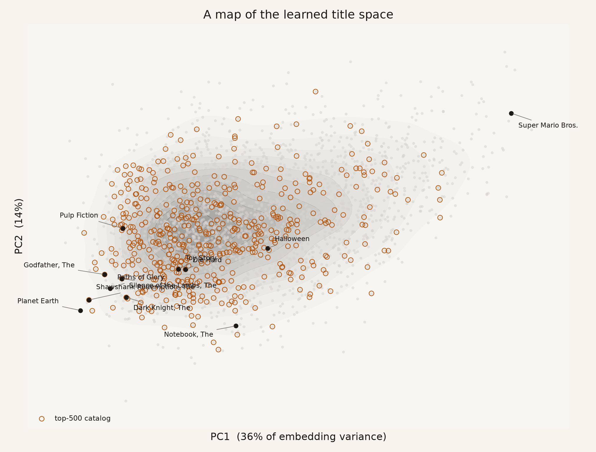

Left-to-right on this picture (PC1, 36% of variance) is roughly
**“widely respected” → “widely shrugged at.”** The orange rings are
the 500 most-rated titles — the stars who already get the playing
time. They sit in the dense middle. *Super Mario Bros.* is isolated
on the right. That isolation is not a hidden gem. It is a bust:
far from the players people actually like.

Genre is visible on the map and is not the map. Same-genre pairs have
mean cosine **0.13**; cross-genre **0.06**. Real structure, lots of
overlap — like finding that “position” explains some of a similarity
search over players and “who they actually produce with” explains
more.

**For a data scientist.** $z_i$ is an `nn.Embedding` row trained
end-to-end with a small transformer. Eight learned *queries* attend
over a user’s title set (no positions: a set, not a sequence). The
training loss is held-out rating MSE, plus a term that pushes the
eight queries apart, plus a small bonus that keeps mixing weights
from collapsing to one component. Two epochs. The queries ended up
orthogonal and still all point at prestige; the mixing weights
$\pi_u$ are essentially uniform. The interesting geometry is in
$z_i$, not in a discovered taxonomy of eight named tastes.

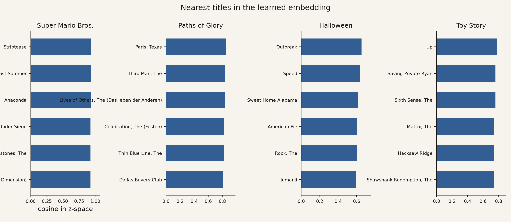

Read each panel as “if you already have the movie on the left, these
are near-substitutes in rater-space.”

- **Super Mario Bros.** → *Striptease*, *Anaconda*, *Police Academy 6*.
  Other widely released movies people also dunked on. A cluster of
  busts, not “kids’ movies.”
- **Paths of Glory** → *Paris, Texas*, *The Third Man*, *The Lives of
  Others*. Serious, often non-Hollywood drama. A neighborhood the
  popular catalog under-covers.
- **Halloween** (1978, the original slasher) → *Speed*, *American Pie*,
  *Jumanji*. Not other horror films. The people who rated *Halloween*
  in MovieLens also rated 1990s Friday-night multiplex hits.
- **Toy Story** → *Up*, then *Saving Private Ryan* and *The Matrix*.
  The “almost everybody loved this” neighborhood.

When two titles are close, covering one taste already covers a lot of
the other. That is why a catalog full of hits still has gaps, and why
another hit in the same blob adds almost nothing.

## 2. Popularity is not roster value

**Plain.** Count how many people rated a movie (popularity). Then ask
how much coverage it adds if you already own the 500 most-rated
movies (MCV). Those two numbers almost do not travel together.

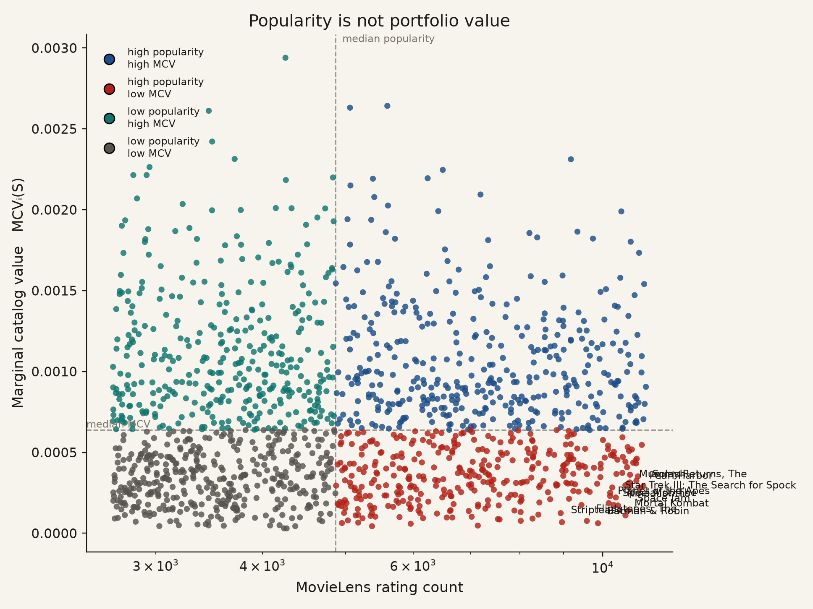

The dashed lines are medians. **Bottom-right (red)** is famous and
redundant: *Batman & Robin*, *Space Jam*, *Pearl Harbor* — big
releases that do not cover anyone new once you already have the hits.
**Top-left (teal)** is the opposite: fewer ratings, high add-on value.
**Top-right** is both famous and still useful. **Bottom-left** is
neither.

If this were baseball: the x-axis is career plate appearances. The
y-axis is “how much does this player raise our current roster’s wins,
given who we already have.” A high-PA 4th outfielder on a team that
already has three can sit on the floor. A lower-PA starter who is the
only one of his type can sit at the top.

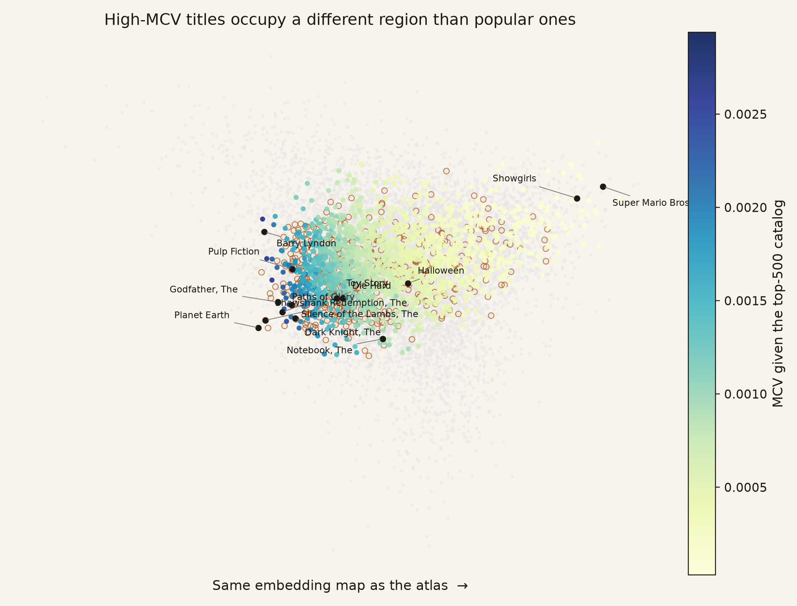

High MCV is the *left* of the map (cinephile / prestige), not the
isolated right. Being far away only helps if you are far away in a
direction people have positive affinity for. *Super Mario Bros.* is
far away in the “we already told you we didn’t like this” direction,
so affinity stays low and MCV stays ~$4\times 10^{-5}$. *Paths of
Glory* is 0.0029 — two orders of magnitude more — with fewer ratings.

**Substitution in one picture.** Add five action near-substitutes
(*Die Hard* through *Terminator 2*) and coverage flattens. Add five
titles that point at different audiences and it keeps climbing
(1.12 vs **1.51**).

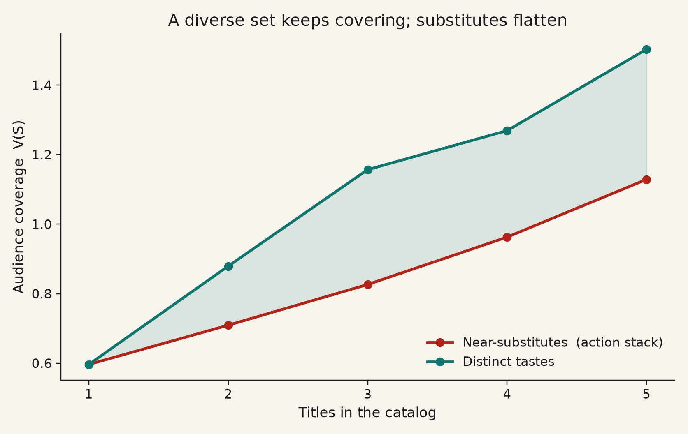

That is the same math as “your third similar reliever has a lower
leverage value than your first lefty specialist,” implemented as
log-sum-exp with $\tau = 0.5$.

The eight-taste mixture is *allowed* to say “this user is 70% horror,
30% kids.” In this checkpoint it does not: mean entropy of $\pi_u$ is
2.077 against a maximum of $\log 8 = 2.079$. Coverage is coming from
the shape of $z_i$ and the submodular $V$, not from users specializing.

## 3. When you have no playing time, you need scouting grades

**Plain.** Collaborative embeddings cannot see a movie nobody rated.
That is the cold-start problem — an international amateur, a Rule 5
name, a film that exists on Disney+ in 2026 and not in MovieLens.
Phase B trains a second model on *what the movie is* (genre, year, and
MovieLens “genome” tags: 1,128 human tags like *horror*, *romance*,
*witty* with a relevance score) and aims it at the same 64-d space.
For titles we hold out, we use only that scouting layer.

**The qualitative jump is the neighbor list.** Collaborative
*Halloween* still thinks *Speed* and *American Pie*. Content
*Halloween* thinks *Texas Chainsaw Massacre*, *The Fog*, *Evil Dead*
— actual slashers. Collaborative *The Notebook* (a 2004 weepie
romance) sat with *Furious 7*. Content puts it with *Little Women*
and *When Harry Met Sally*. The bust is still a bust, just a more
coherent one (*Street Fighter*, *Mortal Kombat: Annihilation* instead
of *Striptease*).

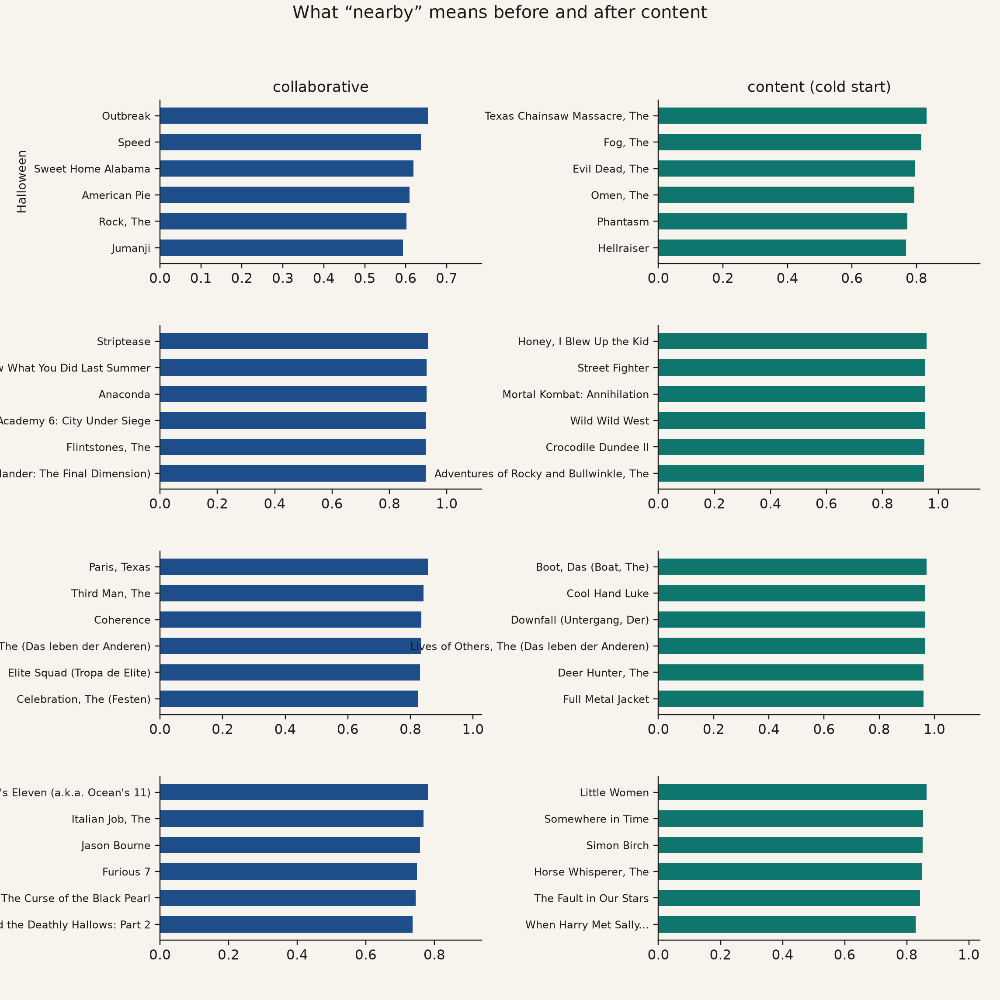

| Probe | Who rated this (stats) | What this is (scouting) |
| --- | --- | --- |
| *Halloween* | 1990s multiplex hits | Classic slashers |
| *The Notebook* | 2000s action franchises | Romances |
| *Paths of Glory* | Serious-drama co-raters | War / prison / moral-crisis films |
| *Super Mario Bros.* | Famous bombs | Kids / video-game bombs |

**For a data scientist.** An MLP maps concatenated genome + genre
multi-hot + scaled year → $(z, b)$. Train on titles with $\ge 200$
ratings, hold out 20%. Euclidean match is tight (residual variance
0.0016); cosine is only ~0.24 because the collaborative vectors are
short, so angle is a noisy readout. The readout that matters for this
project is MCV rank: Spearman **0.79** on held-out candidates. You can
throw away the rating history and still mostly know which add-ons
would have been high- or low-value.

<details>
<summary>Under the hood (shrinkage posterior)</summary>

```math
\mu_i = w_i\, z_i^{\mathrm{collab}} + (1-w_i)\, f(X_i),
\qquad w_i = n_i / (n_i + n_0),\quad n_0 = 400
```

Holdout titles get $w_i = 0$. Variance is
$\sigma_i^2 = \widehat{\mathrm{Var}}(z-f) \cdot (1-w_i)$. Draw
$z_i \sim \mathcal{N}(\mu_i, \sigma_i^2 I)$ and MCV becomes a mean and
a standard deviation. Titles with no collaborative weight are the
uncertain ones — same shape as a projection that widens when the MLB
sample is empty.

</details>

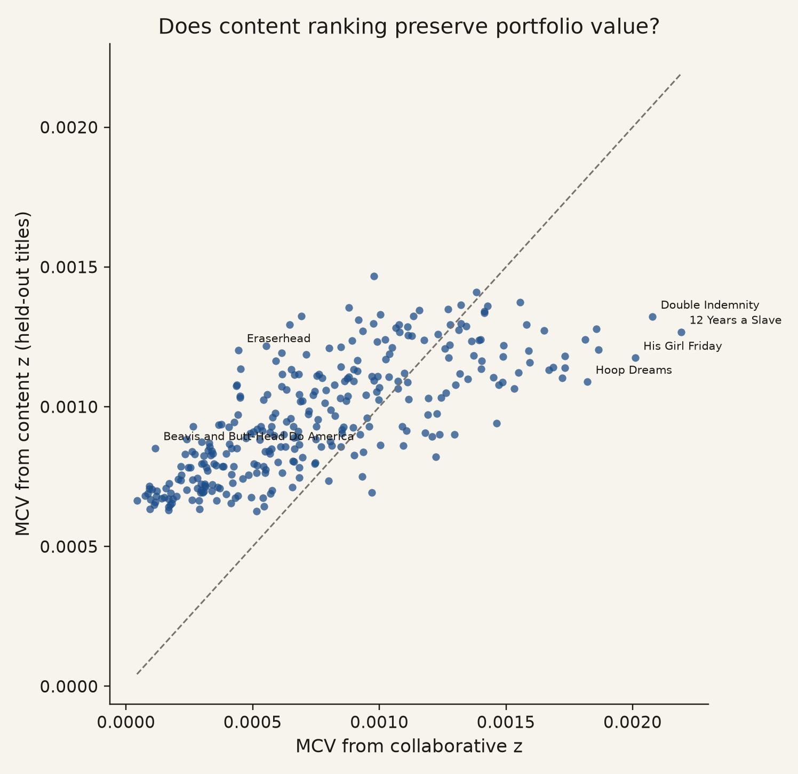

Content **compresses the high end**. *Double Indemnity* (1944 noir,
widely taught as a masterpiece) and *12 Years a Slave* are more
valuable in rater-space than their tags admit. *Eraserhead* (Lynch,
famously weird) is the reverse: tags think it covers a gap;
collaborative raters did not treat it as high-affinity. Those are the
interesting errors — scouting vs observed performance — not a broken
encoder.

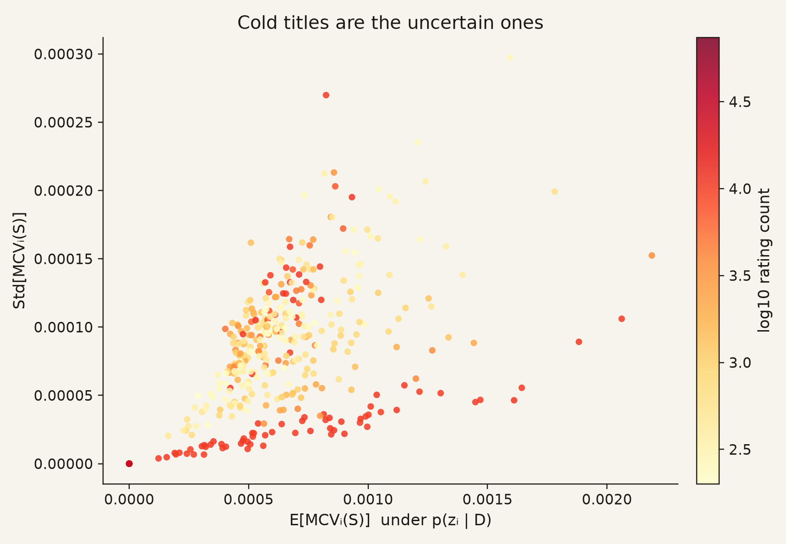

## 4. Real catalogs barely share players. They still play on the same field.

**Plain.** Netflix, Disney+, Prime, Max, and Hulu do not have the same
movies. In our overlap with MovieLens, pairwise title Jaccard is
**≤ 0.07** (Disney+/Hulu is the high at 0.07). They still occupy
overlapping regions of the *who-likes-this* map, because a lot of
different movies can serve the same dense middle of popular taste.
Prime has the most titles in the overlap (1,807) and the highest
coverage $V(S)=4.01$. Hulu has 174 titles and $V=2.83$ — about 10×
fewer films, not 10× less coverage. Extra copies of the same
neighborhood flatten, same as extra similar relievers.

These numbers are **not** “Prime is the best service.” They are
coverage on the MovieLens-era films we can see. MovieLens is mostly
pre-2020 theatrical titles. A 2026 Netflix original with no MovieLens
history is invisible unless we use the content encoder, and even then
we are guessing from tags.

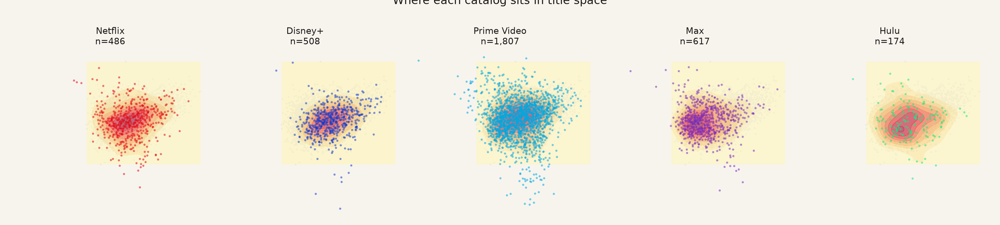

Prime is a wide cloud. Hulu is sparse with a few lumps. Disney+ and
Max show downward tails — a pocket of titles off the main blob.
Netflix is a compact central clump.

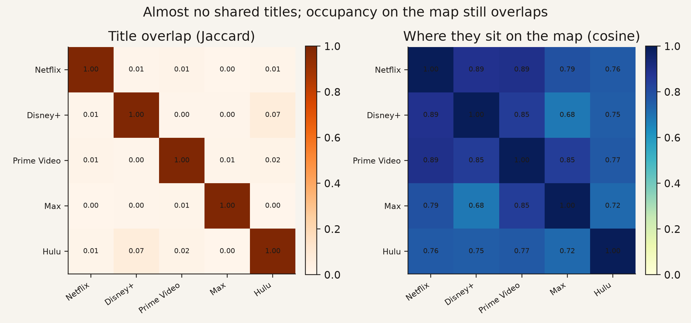

Occupancy cosine (do they sit in the same *places* on the map) is
0.68–0.89. That is “overlapping regions,” not “the same library.”
A separate taste-fingerprint comparison came out as cosine 1.0 for
every pair. Do not read that as “every service covers the same
audience.” It is a **model failure**: mixing weights never specialized,
so the eight taste slots cannot tell services apart. Geography on the
map is the honest statement; the collapsed fingerprints are a warning
not to over-claim $K=8$.

## 5. Averaging over many rosters does not turn a bust into a gap

**Plain.** Maybe *Paths of Glory* only looks valuable because we
measured it against one specific catalog (the 500 most-rated). So
average MCV over 80 random catalogs of 60 titles. That average is
PACV — closer to “how useful is this player across many possible
rosters” than “how useful tonight.” *Paths of Glory* still leads.
The flop cluster still sits on the floor. Popularity still does not
order the list.

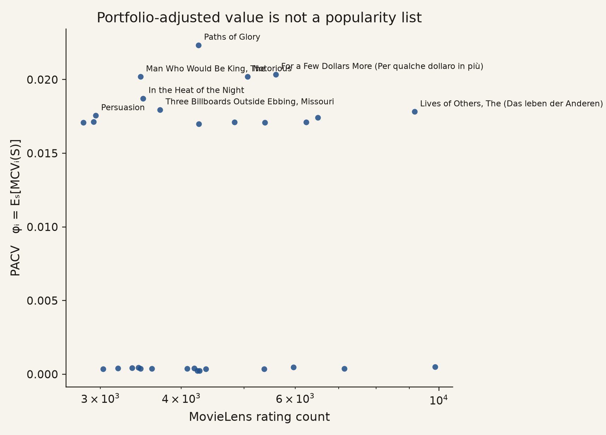

**Building a roster by MCV vs by fame.** Greedy: repeatedly add the
title with the highest MCV given what you already picked. Popularity:
take the most-rated titles in order. At 40 titles, $V$ is 2.55 vs
**2.47**. The lift is small because both pools are already famous
films. The *composition* is not small: a popularity stack is
Action/Adventure-heavy (~43% Action). Greedy MCV cuts Action to ~25%
and roughly doubles Comedy, Crime, and Drama. It is using the extra
picks on types the hit stack under-covers, not stacking more of the
same.

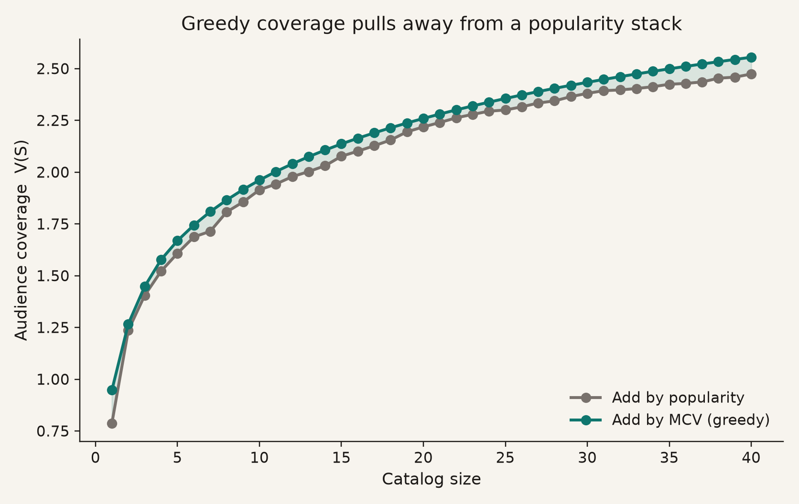

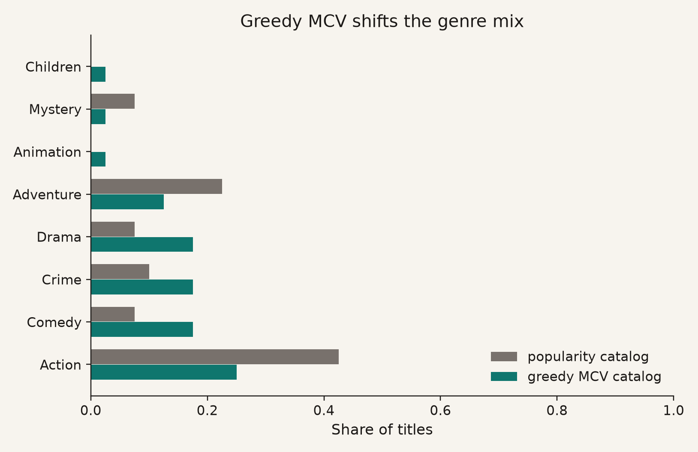

**Is this just the neural net being weird?** Swap the backbone.
Truncated SVD (classic collaborative filtering) plus its own audience
states: Spearman **0.89** with neural MCV rankings. Content-only $z$:
**0.84**. The *order* of “these are the gaps / these are the busts”
is robust. The number on the axis is not — SVD compresses MCV;
content overvalues the low end and undervalues the cinephile high
end. Different projection systems, same ranking argument, different
scale. Do not quote a 0.0029 as a dollar.

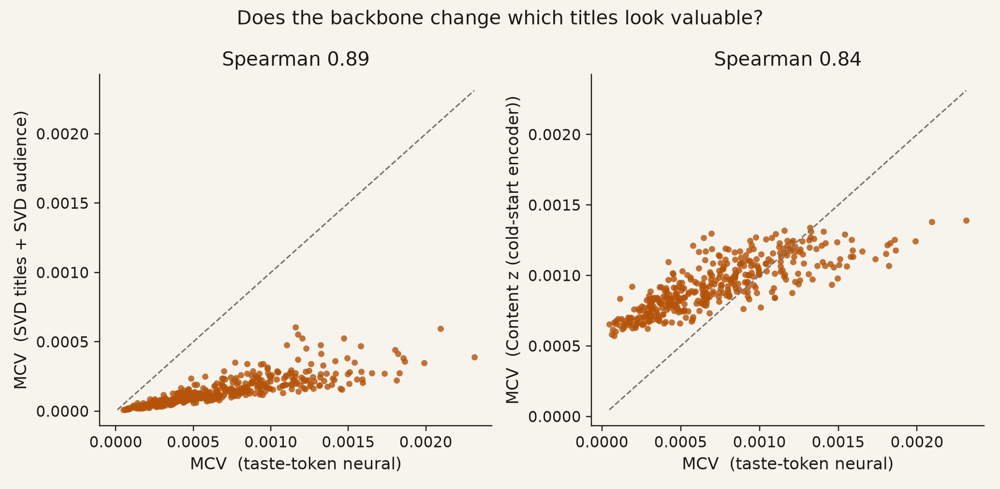

## What this still is not

- **Not eight named taste tribes** (horror fans vs kids vs comedy).
  The architecture can represent that. This fit did not.
- **Not “the model watched the movie.”** Collaborative $z$ is
  co-rating. Semantic neighbors required genome tags. Plots, posters,
  and trailers are unused.
- **Not Netflix’s catalog as you experience it tonight.** TMDB US
  flatrate ∩ MovieLens core. No ranking, no homepage, mostly older
  films.
- **Not “watch A then B” or Marvel-universe complementarity.**
  Log-sum-exp is substitution: once a taste is covered, similar titles
  add less. Complements would need a different $V$.
- **Not retention, revenue, or a buy list.** Preference coverage only.
  The honest sentence is: *under this coverage objective, relative to
  this catalog, these titles look like gaps and these look like
  duplicates.*

## The sentence that survives

Collaborative geometry already separates fame from marginal coverage.
Content makes that geometry *legible as genre* when ratings are
missing. Real catalogs overlap on the map without sharing titles.
Averaging over catalogs does not promote a bust into a gap.

The titles that keep showing up as high-value — *Paths of Glory*,
*Notorious* (Hitchcock, 1946), *The Lives of Others* (German, 2006) —
sit in a region of $z$ that a stack of hits leaves open. The titles
that keep showing up as worthless add-ons — *Super Mario Bros.*,
*Batman & Robin*, *Showgirls* — sit where a lot of people already
told the model they were done. That is a roster-construction result,
not a taste judgment about whether those movies “are good.”
