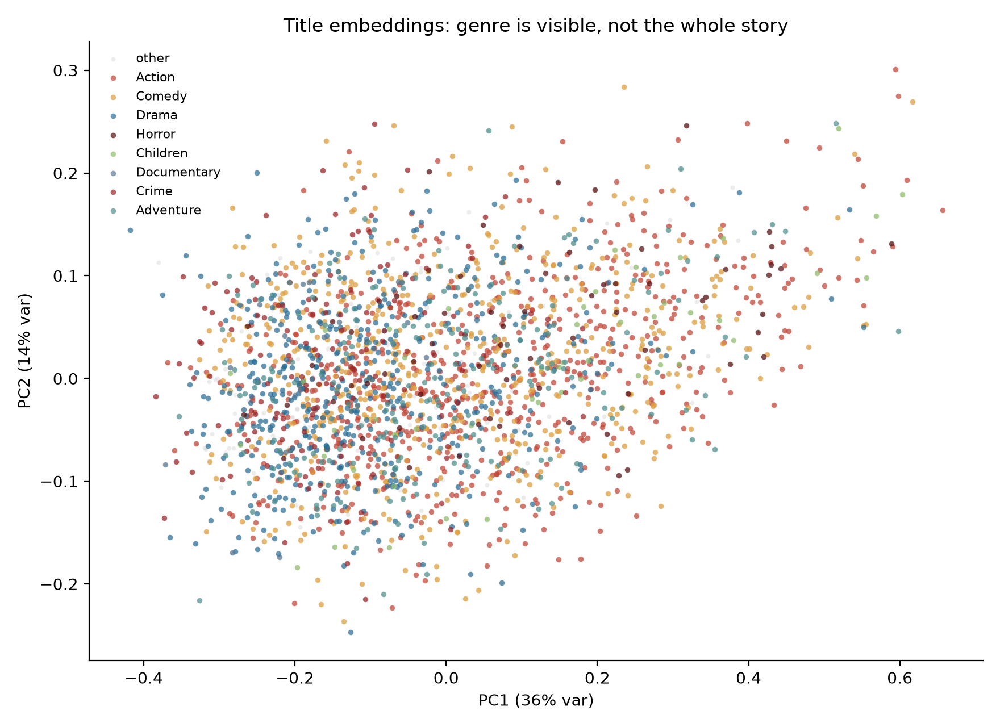
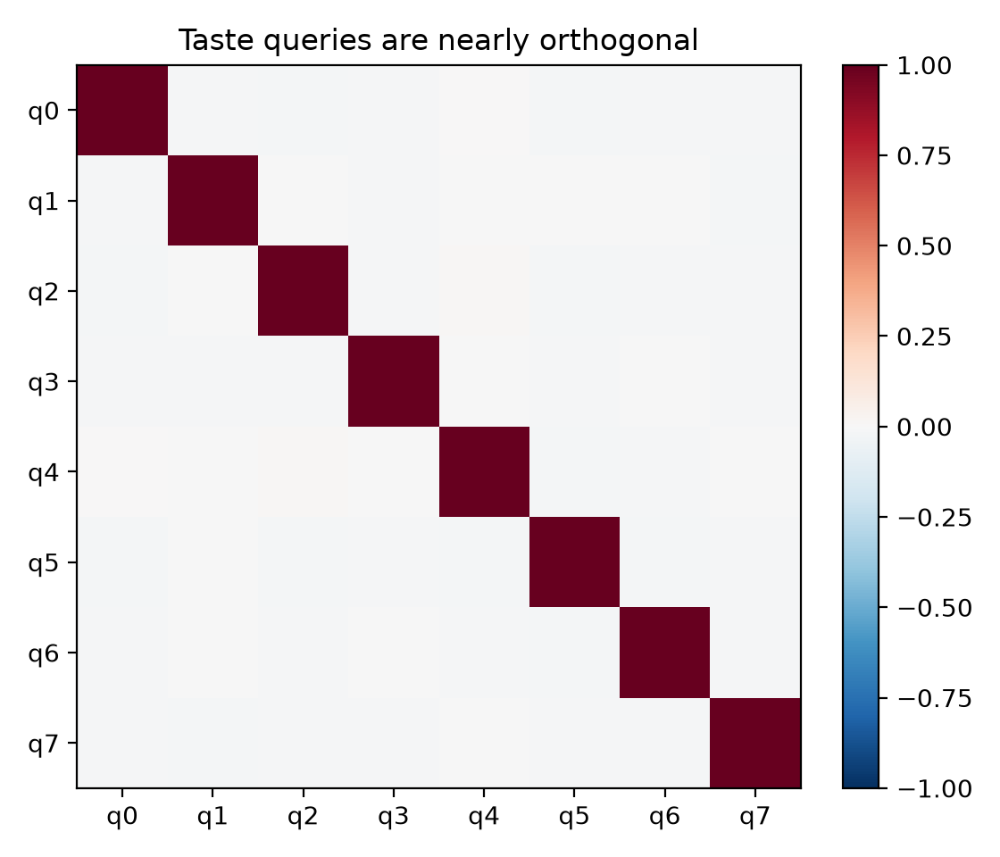
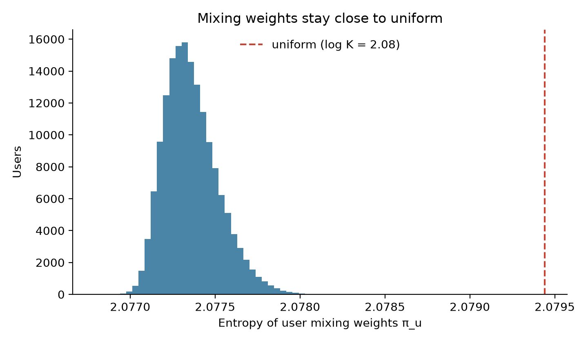
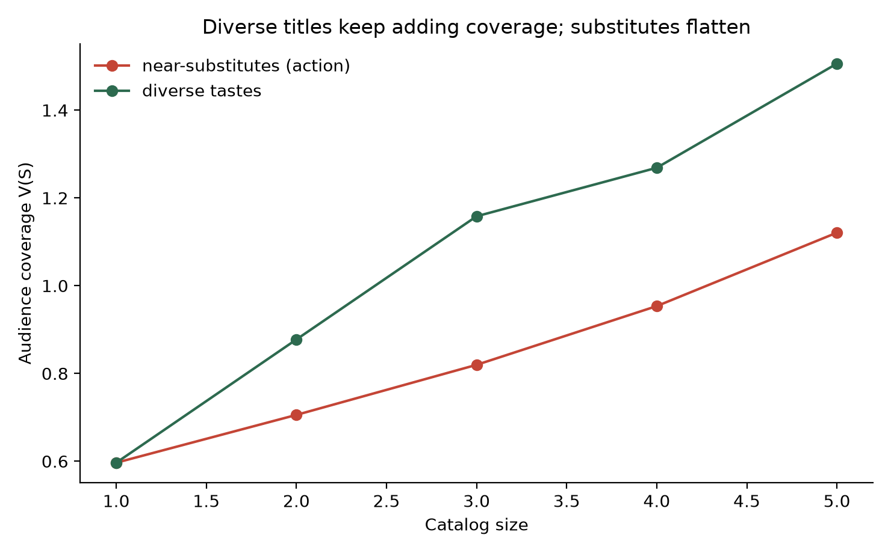
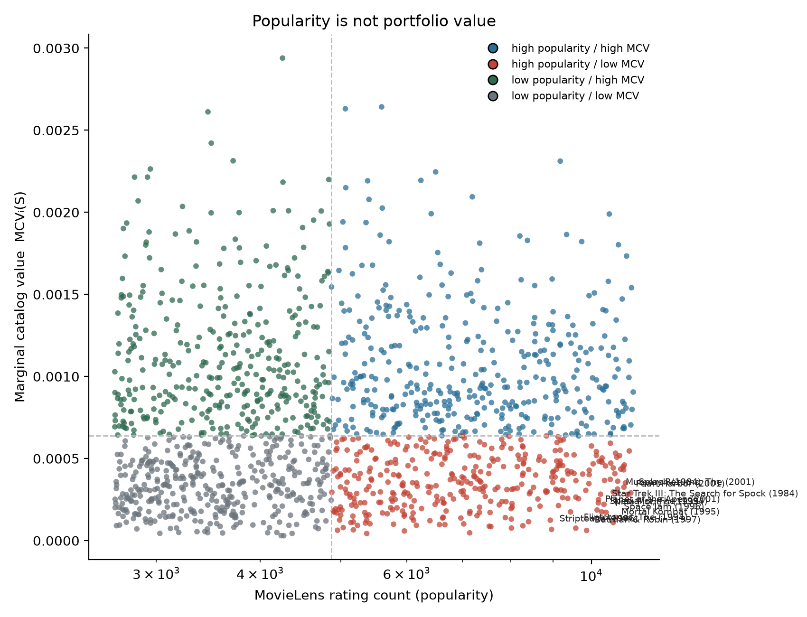
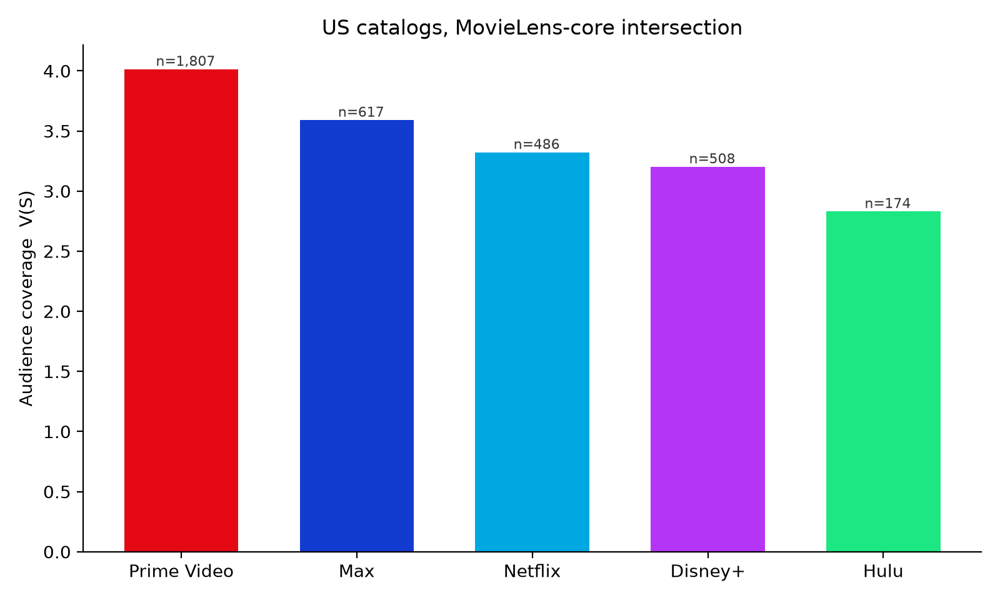
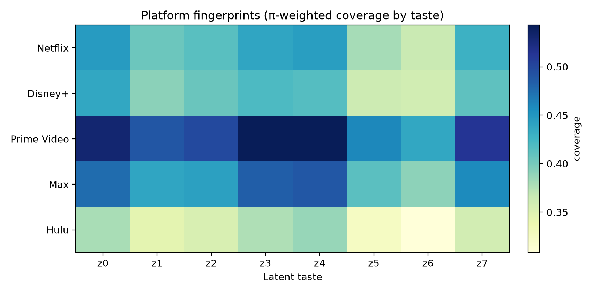

# What each step of the model is saying

Phase A does not score titles by how many people rated them, or by how
likely a user is to click. It estimates **audience-preference coverage**:
how well a *set* of titles covers heterogeneous latent tastes, then how
much coverage a new title would add given that set.

The first trained run already separates those quantities. Against a
catalog of the 500 most-rated MovieLens titles, popularity and marginal
catalog value among the next 1,500 titles have Spearman correlation
**0.07**. That is the claim the rest of this note unpacks: what the
embeddings actually store, what the taste mixture is (and is not) doing,
and why a widely rated flop can be almost worthless as a portfolio
component.

This is a reading of one fit (2 epochs, rating MSE, $K=8$, dim 64). It
is not a licensing recommendation.

Regenerate the figures from a trained checkpoint:

```bash
uv run python experiments/model_story.py
```

## The objects, in order

```math
\text{ratings } D
\;\longrightarrow\;
z_i,\; b_i
\;\longrightarrow\;
q_k,\; \pi_u,\; z_{uk}
\;\longrightarrow\;
a_{uki}
\;\longrightarrow\;
V_u(S)
\;\longrightarrow\;
\mathrm{MCV}_i(S)
```

| Step | Object | What it is trying to say |
| --- | --- | --- |
| Data | MovieLens 25M core | Who rated what, and how highly — not plot, not watch time, not homepage rank |
| Content | $z_i \in \mathbb{R}^{64}$, $b_i$ | Titles that the *same people* like sit nearby |
| Queries | $q_1,\ldots,q_8$ | Eight directions the encoder can use to split a user's history |
| Audience | $\pi_u$, $z_{uk}$ | How much of user $u$ lives on each direction, and where |
| Affinity | $a_{uki} = z_{uk}^\top z_i + b_i$ | How well title $i$ matches taste $k$ of user $u$ |
| Coverage | $V_u(S)$ | Soft-OR over titles inside each taste, then mixture over tastes |
| Marginal | $\mathrm{MCV}_i(S)=V(S\cup\{i\})-V(S)$ | How much *new* coverage $i$ adds given $S$ |

The encoder is trained only on the first arrow (predict held-out
ratings). Everything from $V(S)$ onward is an analytical readout of
those embeddings, not a second trained network.

## Data

MovieLens 25M, filtered to users with $\ge 20$ ratings and movies with
$\ge 50$ ratings: **162,242 users × 13,176 titles**. Histories are
treated as *sets* (no positions). Training holds out 4 ratings per user,
feeds up to 64 other titles as context, and fits 2 epochs of AdamW on
Apple MPS.

Loss:

```math
\mathcal{L}
=
\mathrm{MSE}(\hat r, r)
+ 0.05 \cdot \lVert Q^\top Q - I \rVert_{\mathrm{off}}^2
- 0.01 \cdot H(\pi_u)
```

The diversity term pushes the eight taste queries apart. The entropy
bonus fights collapse of $\pi_u$ onto one component. Neither term
knows about catalogs.

## Title embeddings: “who likes this,” not “what this is about”

Each title is a point $z_i$ in 64-dimensional space, plus a scalar
bias $b_i$. Those vectors are ordinary collaborative-filtering
embeddings: gradient descent moves two titles together when the same
users give them similar held-out ratings.

They are **not** plot embeddings, tag embeddings, or trailer embeddings.
Genre is visible in a 2-D PCA of $z_i$, and it is not the whole map.
The first two principal components explain 36% and 14% of variance
(50% together; eight components reach 71%). Same-genre pairs among
well-observed titles have mean cosine **0.13**; cross-genre pairs
**0.06**. Real structure, lots of overlap.



Nearest neighbors among titles with $\ge 2{,}000$ ratings make the
geometry concrete.

**Toy Story (1995)** sits next to *Up*, then *Saving Private Ryan*,
*The Sixth Sense*, *The Matrix*, *Hacksaw Ridge*, *The Shawshank
Redemption*. That is not “animation.” It is the cluster of titles that
a huge slice of MovieLens rated highly — family adventure sharing a
neighborhood with widely loved prestige.

**Pulp Fiction (1994)** → *Fargo*, *The Sweet Hereafter*, *The
Godfather Part II*, *Stop Making Sense*, *One Flew Over the Cuckoo's
Nest*. Crime/prestige cinephile co-rating, not “any crime movie.”

**The Dark Knight (2008)** → *Inception*, *Saving Private Ryan*,
*Office Space*, *Shawshank*, *The Matrix*. Modern epic / widely canonized
2000s film, with *Office Space* as a reminder that co-rating $\neq$
tone.

**Halloween (1978)** → *Outbreak*, *Speed*, *Sweet Home Alabama*,
*American Pie*, *The Rock*, *Jumanji*. Not other slashers. 1990s
video-store multiplex: the people who rated *Halloween* in this dataset
also rated the era's mainstream hits.

**The Notebook (2004)** → *The Italian Job*, *Furious 7*, *Pirates of
the Caribbean*, *Harry Potter and the Deathly Hallows*. Romance did
not form a clean island after two epochs; the model parked it with
2000s multiplex titles that the same raters touched.

**Paths of Glory (1957)** → *Paris, Texas*, *The Third Man*, *The Lives
of Others*, *Festen*, *The Thin Blue Line*, *Dallas Buyers Club*. A
tight cinephile / elevated-drama neighborhood. This is the geometry
that later shows up as high MCV: these titles occupy a region the
popular catalog under-covers.

**Super Mario Bros. (1993)** → *Striptease*, *I Still Know What You
Did Last Summer*, *Anaconda*, *Police Academy 6*, *The Flintstones*,
*Highlander III*. The flop neighborhood. Widely rated, widely disliked,
substitutable with other widely rated dislikes. That is why high
popularity can still mean near-zero marginal coverage.

**Planet Earth (2006)** → *All About Eve*, *My Neighbor Totoro*,
*Spirited Away*, *Princess Mononoke*. “Gentle prestige” rather than
“documentary as a genre.”

The embedding is a map of **shared raters**, with genre as a faint
overlay. When two titles are close, the model is saying: *covering one
of these tastes already covers a lot of the other*.

Item bias barely moved ($b_i$ vs $\log_{10} n_{\text{ratings}}$
correlation **0.03**). Popularity is not being absorbed into a scalar
offset; it lives in how densely the popular titles pack the same region
of $z$.

## Taste queries: eight orthogonal directions, one prestige magnet

The encoder does not give each user a single vector. It keeps **eight
learned queries** $q_k$. Each query attends over the user's title set
(multi-head attention, no positions), residual-adds back to itself, and
becomes a per-user taste state $z_{uk}$. A linear head on $z_{uk}$
produces mixing weights $\pi_u$.

The diversity loss worked. Off-diagonal RMS cosine among the eight
queries is **0.012** — they are nearly orthogonal.



Orthogonality is not the same as *semantic specialization*. Ranking
titles by $z_i^\top q_k$ (min 2,000 ratings) puts prestige canon on
almost every query: *Shawshank*, *Schindler's List*, *The Godfather*,
*Saving Private Ryan*, *Paths of Glory*. Query 0 leans war/drama
(*SPR*, *American History X*, *Braveheart*). Query 2 leans crime
canon (*Godfather*, *Goodfellas*, *Usual Suspects*). Query 4 mixes
*Shawshank* with *Blade Runner* and *Princess Mononoke*. None of them
is “horror,” “rom-com,” or “kids.”

After two epochs the queries are distinct *vectors* pointing at
overlapping *regions* of the same high-rating manifold. The architecture
can represent multiple interests; this checkpoint has not yet used that
capacity to split the audience into recognizable taste tribes.

## Mixing weights: the mixture is still almost uniform

$\pi_u$ is a softmax over eight logits. Maximum entropy is
$\log 8 \approx 2.079$. Mean user entropy is **2.077**, and the whole
histogram sits against that upper bound. Per-component means range from
0.11 to 0.13; per-component standard deviations are $< 0.001$.



The entropy bonus in the loss is doing its job too well, or training is
too short for $\pi$ to move. Either way, **this run is not a story
about users specializing**. Almost every user is an equal mixture of
the eight queries.

What *does* vary by user is $z_{uk}$: the attended states, not the
global queries. Mean off-diagonal cosine among a user's eight taste
vectors is 0.03 (RMS 0.08) — more overlap than the queries, still not
collapsed to one vector. The coverage function therefore still has
eight slightly different affinities per user, even though it weights
them almost evenly.

## Affinity and coverage: substitution is the whole point

Affinity is a dot product in the same space:

```math
a_{uki} = z_{uk}^\top z_i + b_i
```

Catalog utility is not a sum of affinities. Inside each taste it is a
soft coverage function, then a mixture:

```math
V_u(S)
=
\sum_{k=1}^{K}
\pi_{uk}\,
\tau\log\Bigl(1 + \sum_{i\in S} e^{a_{uki}/\tau}\Bigr),
\qquad \tau = 0.5
```

```math
V(S) = \mathbb{E}_u[V_u(S)]
```

$\tau \to 0$ approaches $\max_i a_{uki}$ (strong substitution: the
best title for a taste saturates it). $\tau \to \infty$ approaches
additive value. At $\tau = 0.5$, a second title that points the same
way as the first adds little; a title that points somewhere else still
moves $V$.

That is visible in a five-title toy catalog, evaluated on 1,500 random
users.

| Catalog grows by… | Near-substitutes (Die Hard → T2) | Diverse (Die Hard, Toy Story, Silence of the Lambs, When Harry Met Sally, Planet Earth) |
| --- | ---: | ---: |
| 1 title | 0.60 | 0.60 |
| 2 | 0.71 (+0.11) | 0.88 (+0.28) |
| 3 | 0.82 (+0.11) | 1.16 (+0.28) |
| 4 | 0.95 (+0.13) | 1.27 (+0.11) |
| 5 | 1.12 (+0.17) | 1.51 (+0.24) |

The diverse stack is ~34% higher at size 5. *When Harry Met Sally*
adds less than the others in this checkpoint (the Notebook-style
romance mush in embedding space), which is itself a finding: the
coverage function can only reward diversity the embeddings actually
represent.



$V(S)$ for the 500 most-rated titles is **3.49** (4,000 eval users).
That number is not dollars and not watch hours. It is mean soft
coverage on this scale, with $\tau=0.5$.

## Marginal catalog value: the popular flop vs the cinephile gap

```math
\mathrm{MCV}_i(S) = V(S \cup \{i\}) - V(S)
```

$S$ here is those 500 most-rated titles. Candidates are the next 1,500
by rating count. MCV ranges from $3\times 10^{-5}$ to $0.0029$.
Spearman with raw popularity: **0.07**. Pearson with $\log_{10} n$:
**0.03**.



The scatter is the Phase A result. Four quadrants, split at the medians:

**High popularity, low MCV** — *Super Mario Bros.* (MCV $4.3\times 10^{-5}$),
*Showgirls*, *Anaconda*, *Batman & Robin*, *Speed 2*, *Striptease*,
*The Flintstones*. These are exactly the flop neighborhood of the
embedding. Many people rated them; the popular catalog already covers
the people who would have liked a better version of the same thing, and
the people who rated them low do not generate affinity.

**Low popularity, high MCV** — *Paths of Glory* (0.0029), *The Man Who
Would Be King*, *In the Heat of the Night*, *Three Billboards*,
*Persuasion*, *In the Mood for Love*, *Barry Lyndon*, *Grave of the
Fireflies*. Fewer ratings than the blockbusters, but they sit in the
cinephile region that the top-500 under-serves. Adding one of them
covers a taste the popular stack leaves open.

**High popularity, high MCV** — *For a Few Dollars More*, *Notorious*,
*The Lives of Others*, *The Philadelphia Story*. Well-observed titles
that still stick out of the blob.

The model is not saying the flops are “bad movies” in an aesthetic
sense. It is saying: **given a catalog already full of widely rated
titles, these do not cover anyone new.** *Paths of Glory* is the
opposite sentence: a smaller rater base, a region of $z$ that $S$
does not occupy.

## Streaming catalogs: size, then density, then caveats

US flatrate catalogs from TMDB, intersected with the MovieLens core
(not the full 2026 libraries; MovieLens 25M is mostly pre-2020).
Scored with the same $V(S)$ on 4,000 users.

| Service | $\|S \cap \mathrm{ML}\|$ | $V(S)$ | $V$ per title |
| --- | ---: | ---: | ---: |
| Prime Video | 1,807 | 4.01 | 0.0022 |
| Max | 617 | 3.59 | 0.0058 |
| Netflix | 486 | 3.32 | 0.0068 |
| Disney+ | 508 | 3.20 | 0.0063 |
| Hulu | 174 | 2.83 | 0.016 |



Prime's intersection is 10× Hulu's and only ~1.4× the coverage. That
is the same diminishing-returns curve at catalog scale. Hulu's per-title
$V$ is high because a small set still hits the dense, widely loved
region of $z$; Prime fills that region many times over. Netflix edges
Disney+ on $V(S)$ with fewer overlapping titles.

None of this is “Prime is the best service” or “Hulu should license
X.” Under this coverage objective, on this intersection, extra copies
of the same collaborative neighborhood add less than the raw library
size suggests.

Platform fingerprints — $\pi$-weighted coverage per taste — are
fairly flat across the eight components. That is expected while $\pi$
is uniform and the queries all point at prestige. The heatmap is a
preview of a diagnostic that becomes interesting once tastes actually
specialize.



Highest-MCV additions into those catalogs, restricted to titles with
$\ge 1{,}000$ ratings, again surface *Planet Earth*, *Paths of Glory*,
*Shawshank*, *The Godfather*, Ghibli, documentaries — the under-covered
prestige / cinephile pocket — not the flop neighborhood. For the
smallest catalog (Hulu) those increments are larger, which is MCV doing
its job: the same title is worth more when $S$ is smaller.

## What this checkpoint is not saying

- **Not plot semantics.** Neighbors of *Halloween* and *The Notebook*
  are the proof. A content encoder (Phase B) would change this.
- **Not eight named tastes.** Queries are orthogonal; their top titles
  are not. Longer training, a stronger diversity-on-*states* term, or
  a catalog-value loss could split them.
- **Not user-level specialization.** $\pi_u$ is essentially uniform.
- **Not a posterior.** $z_i$ is a point estimate. Cold-start and
  $p(\mathrm{MCV}_i(S)\mid D)$ need $p(z_i\mid D)$.
- **Not complementarity.** Log-sum-exp is submodular substitution.
  Sequels, universes, and “watch A then B” are out of scope.
- **Not full streaming libraries.** TMDB US flatrate $\cap$ MovieLens
  core, mostly older theatrical titles.
- **Not retention, revenue, or a buy list.** Audience-preference
  coverage only.

The honest sentence for this run: **collaborative title geometry plus
a submodular coverage function is already enough to make popularity and
marginal catalog value come apart**, and the titles that come apart do
so for readable embedding reasons — flop clusters vs cinephile gaps —
even while the multi-interest mixture is still barely using its $K$.
